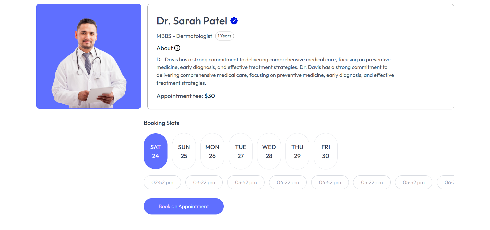

# 🩺 PRESCRIPTO - Medical Appointment Web App

**Prescripto** is a modern medical web platform that allows users to browse doctors by specialty and book appointments easily. Built using **React.js** and **Tailwind CSS**, it offers a seamless and responsive user experience across devices.

---

## 🚀 Live Demo

## 🔗 [Click Here To View](https://prescripto-medical-app.vercel.app/)

---

## 🖼️ Screenshots




---

## 🎯 Features

- 👨‍⚕️ Browse doctors by specialization
- 📄 View doctor profiles (name, image, specialization)
- 📆 Book medical appointments
- 📱 Responsive UI for all screen sizes
- 🚀 Fast performance with React + Tailwind
- 🔄 Smooth navigation with React Router
- 🌐 Global state management via Context API

---

## 🛠️ Tech Stack

| Technology   | Description                   |
| ------------ | ----------------------------- |
| React        | UI Components & SPA structure |
| Tailwind CSS | Utility-first styling         |
| React Router | Navigation between pages      |
| Vite         | Development server and build  |
| Context API  | State Management              |

---

## 📁 Folder Structure

```bash
src/
├── Assets/        # Images, icons
├── components/    # Reusable UI components
├── pages/          # Home, Doctors, Appointment
├── context/       # Global state
├── App.jsx        # Main app component
├── main.jsx       # Entry point
└── index.css      # Tailwind base styles
```

---

## 📦 Getting Started

### 1. Clone the repository

```bash
git clone https://github.com/Ghonamy/Prescripto-Medical-App.git
cd Prescripto-Medical-App
```

### 2. Install dependencies

```bash
npm install
```

### 3. Run the development server

```bash
npm run dev
```

> ✅ Requires Node.js and npm

---

## 📌 Future Improvements

- 🔐 Add authentication (login/signup)

- 🩺 Doctor dashboard (manage appointments)

- 📝 Patient medical records system

- ☁️ Backend integration (Express.js + MongoDB)

---

### 💬 Feel free to fork, clone, and customize
